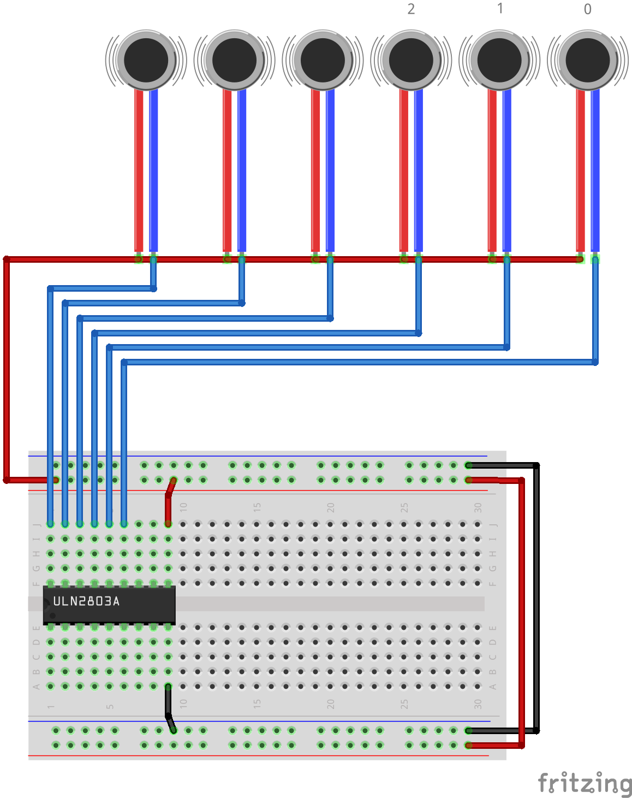
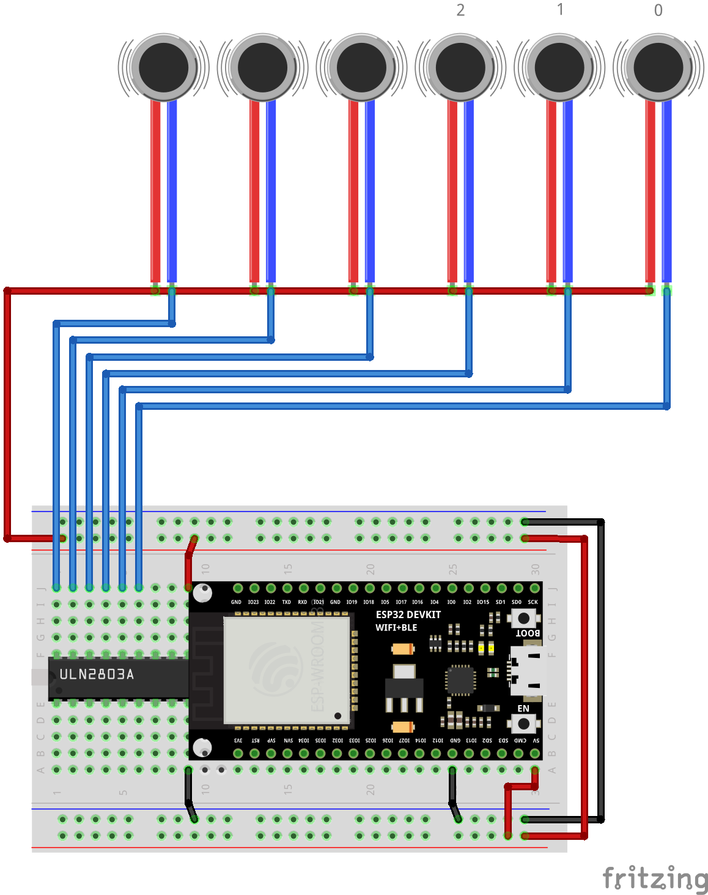
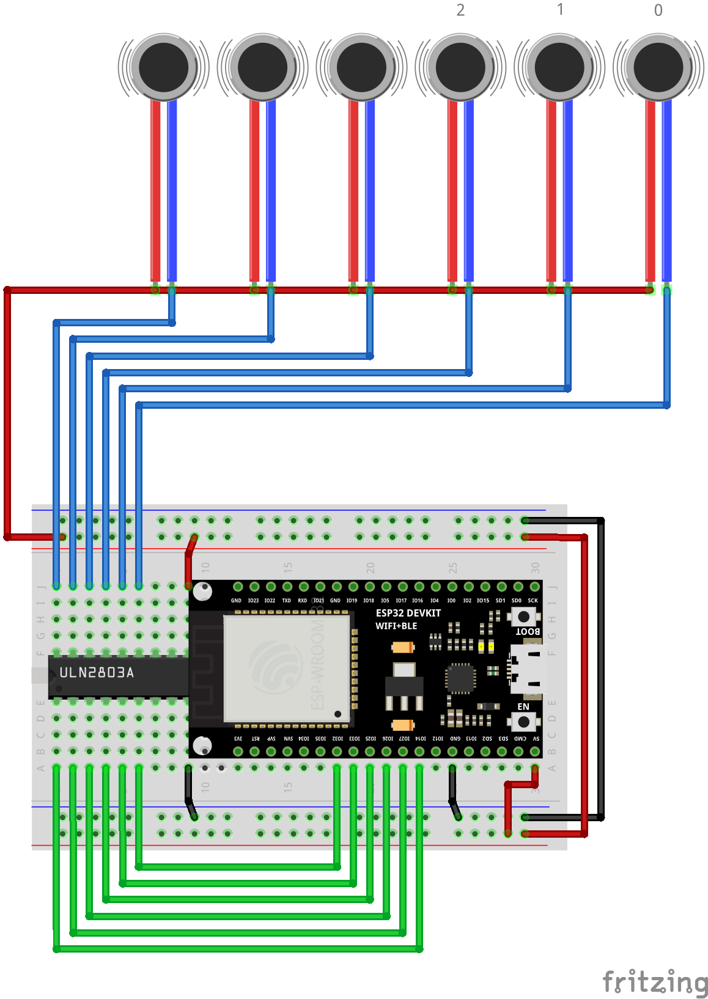

import VerifiedParts from '@site/src/components/VerifiedParts'
import verifiedParts from '@site/src/verified-parts'

# Building Haptic Face Interface for Quest 2

Haptic Face Interface is the easiest OpenHaptics device you can build, and we recommend starting your journey with OpenHaptics with it! With 6 Haptic Feedback Points, you will deeply improve your immersion by feeling every touch and punch into your face.

Our Face Interface is supported by many games and works great with Standalone VR headsets, such as Meta Quest 2. It achieves it by providing a compatibility layer for bHaptics, making it possible to support **[bHaptics Tactal](https://www.bhaptics.com/tactsuit/tactal)** supported games.

:::caution
Keep in mind that this guide is a work-in-progress and may not be complete, so you may need to do some additional research and problem-solving on your own.

If you need help or guidance along the way, be sure to consult with our community on [Discord](https://discord.gg/YUtRKAqty2).
:::

## Prerequisites

1. Oculus Quest 2
2. Soldering skills or will to learn

## Build Guide

### Step 1: Purchasing required components

A small variety of hardware components is required to build your DIY Haptic Face Interface. You can find a table with list of required components below. You'll also need some tools, such as _Soldering Iron_ and _knife or scalpel_ for device assembly.

<VerifiedParts
  parts={[
    'ESP32-DevKitC V4',
    'ULN2803',
    ['Coin Vibration Motor', 6],
    'Half Sized Breadboard',
    'Jumper Wires',
    'Wires for soldering',
    'Facial Interface for Quest\u00A02',
  ]}
  allParts={
    Object.assign({}, verifiedParts, {
      'Facial Interface for Quest\u00A02': {
        'Global': [
          {
            suffix: 'KIWI Design',
            url: 'https://www.aliexpress.com/item/1005001962531119.html',
            pricePer: 29.00,
          },
          {
            suffix: 'BOBOVR F2',
            url: 'https://www.aliexpress.com/item/1005004346161285.html',
            pricePer: 62.00,
          },
          ['https://int.vrcover.com/collections/facial-interface-foam-replacements/products/facial-interface-foam-replacement-basic-set-for-oculus%E2%84%A2-quest-2', 29.00],
        ],
        'North America': [
          ['https://www.meta.com/quest/accessories/quest-2-standard-facial-interface/', 24.99],
          ['https://us.vrcover.com/collections/facial-interface-foam-replacements/products/facial-interface-foam-replacement-set-for-oculus%E2%84%A2-quest-2-standard-edition', 29.00],
          {
            suffix: 'VR Cover',
            url: 'https://www.meta.com/quest/accessories/quest-2-vr-cover-facial-interface-foam-replacement-set/',
            pricePer: 29.00
          },
        ],
        'Europe': [
          ['https://eu.vrcover.com/collections/facial-interface-foam-replacements/products/facial-interface-foam-replacement-basic-set-for-oculus%E2%84%A2-quest-2', 29.00],
        ],
      }
    })
  }
/>

<!-- I know it's a dirty trick -->

### Step 2: Connect ULN2803

Insert your ULN2803 Darlington transistor arrays into the left-most part of your breadboard. Make sure, that _indent_ on ULN2803 is _on the left_, and _red line_ is on the _bottom_ of your breadboard. Connect `GND` and `5V` wires according to diagram below.

| Wiring Diagram | Photo |
| :------------: | :---: |
|  |  |

### Step 3: Wire vibration motors

For this step you'll need to make cuts in your Face Interface replacement. Make evenly-spaced cuts with knife to fit vibration motors in face pad (you can find image with motor locations below).
Alternatively, you can attach motors with tape, if you do not feel like damaging your face interface.

Solder your Vibration Motor wires as per diagram below. Your _red_ wires have to be connected into one line, and each _blue_ wire connected to ULN2803 separately.

| Motor Placement                                                        | Photo |
| :--------------------------------------------------------------------: | :---: |
|  |  An example by [DonSalami in our Discord server](https://discord.com/channels/966090258104062023/1024776203095257181/1039106722352074782) |

| Wiring Diagram                                                                   | Photo |
| :------------------------------------------------------------------------------: | :---: |
|  |  |

### Step 4: Connect ESP32 power pins

Insert your ESP32 into the right-most part of your breadboard. Make sure, that you have a single row of non-obstructed below your ESP32 to connect wires later. Connect `5V` pin with _red_ line and `GND` pin with _blue_ line with jumper wires.

| Wiring Diagram                                                              | Photo |
| :-------------------------------------------------------------------------: | :---: |
|  |  |

### Step 5: Connect ESP32 data PWM pins

Connect pins `IO14`, `IO27`, `IO26`, `IO25`, `IO33`, `IO32` with your ULN2803 with jumper wires array as per diagram below.

| Wiring Diagram                                                                | Photo |
| :---------------------------------------------------------------------------: | :---: |
|  |  |

### Step 6: Flash firmware

Use any of our [Firmware Flashing methods](/docs/category/flashing-firmware) and flash Face Interface (Tactal) firmware.

## Final Result

### Final Wiring Diagram

